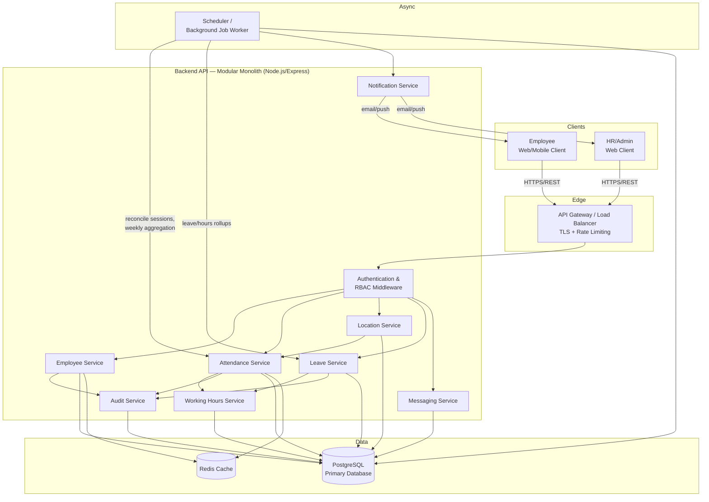
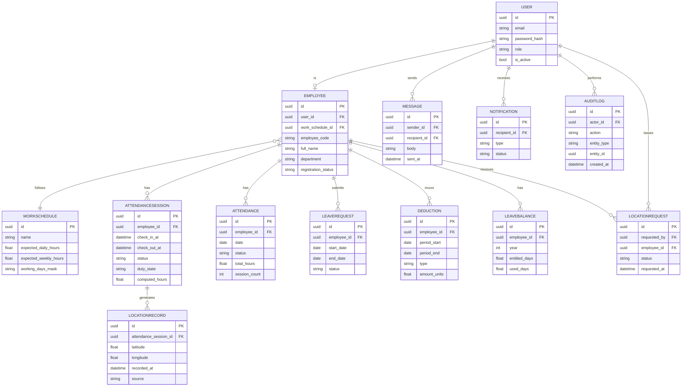
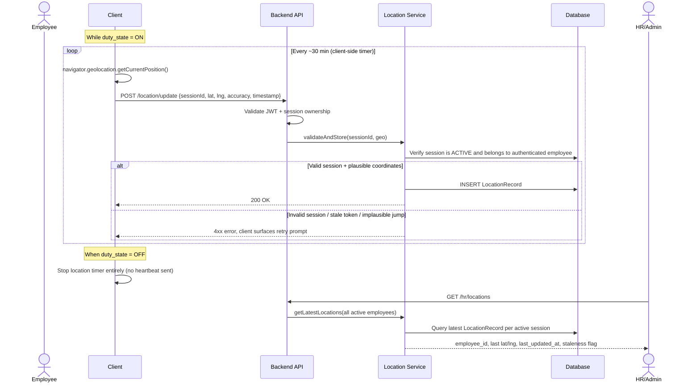
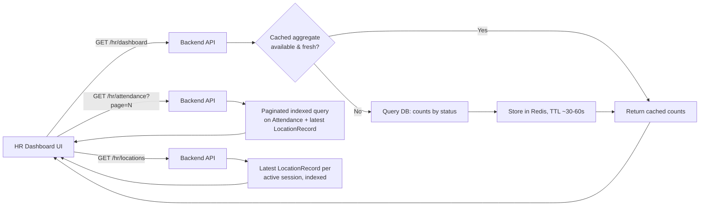
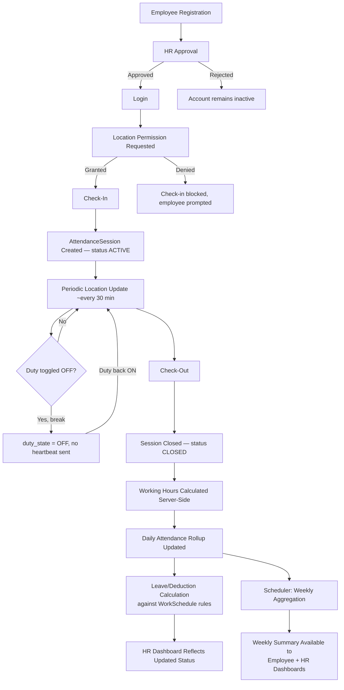

# High-Level Design (HLD)
## Employee Attendance Management System

**Document Type:** High-Level Design (HLD)
**Prepared For:** Developer Assessment / Interview Submission
**Version:** 1.0
**Date:** September 2026

---

## Table of Contents

1. Executive Summary
2. Scope
3. Actors / User Roles
4. Functional Requirements
5. Non-Functional Requirements
6. High-Level System Architecture
7. Architecture Diagram
8. Module / Component Design
9. Database Design
10. ER Diagram
11. Attendance Flow
12. Location Tracking Flow
13. Working Hours Calculation
14. Leave / Deduction Calculation
15. Attendance Status Tracking
16. HR Dashboard Architecture
17. Employee Dashboard Architecture
18. API Design
19. Authentication & Authorization
20. Security Design
21. Scheduler / Background Jobs
22. Error Handling
23. Data Consistency & Concurrency
24. Scalability
25. Performance
26. Logging & Monitoring
27. Deployment Architecture
28. Technology Stack
29. Key Architectural Decisions
30. Assumptions & Open Questions
31. Final End-to-End Flow
32. HLD Summary

---

## 1. Executive Summary

The Employee Attendance Management System (EAMS) is a backend-driven web/mobile platform that lets an organization capture, validate, and report on employee attendance without relying on physical biometric hardware. Employees register, get approved by HR, and then check in/out from a browser or mobile client, granting periodic location access so the system can confirm they were present in an expected area while on duty. The backend independently computes working hours and leave/deduction figures from stored check-in/check-out events — it never trusts numbers sent by the client — so the data HR sees is authoritative.

**Primary users:**
- **Employees** — register, check in/out, toggle duty status, view their own attendance/leave history, message HR, and respond to location requests.
- **HR / Admin** — approve registrations, monitor real-time attendance and location status of the whole workforce, review weekly working-hours and leave summaries, and communicate with employees.

**Main objectives:**
- Replace manual/paper attendance tracking with a lightweight, auditable digital system.
- Provide HR with a live, aggregated view of who is working, where, and for how long.
- Compute working hours and deductions consistently and transparently, with all business rules server-side and configurable per employee type/shift.
- Keep the design proportionate to an assessment-level project: a modular monolith, not a microservices platform.

**Major capabilities:**
- Registration → HR approval → login workflow with RBAC (Employee vs HR/Admin).
- Check-in/check-out with duty ON/OFF and periodic (~30 min) location/attendance heartbeat.
- Server-computed working hours, weekly aggregation, and configurable leave/deduction rules.
- Real-time-ish HR dashboard (present/absent/on-leave/working, locations, pending approvals).
- Lightweight internal messaging and location-request workflow between Employee and HR.
- Full audit trail of attendance and location events for compliance and dispute resolution.

---

## 2. Scope

### In-Scope
- Employee self-registration and HR/Admin approval workflow.
- JWT-based authentication and RBAC for two roles: Employee, HR/Admin.
- Check-in / check-out, duty ON/OFF toggling, and one active attendance session per employee per day (with multi-session support for break-out/break-in patterns).
- Periodic (~30-minute) location and attendance heartbeat while on duty.
- Server-side working-hours calculation (daily and weekly aggregation).
- Configurable leave/deduction calculation engine (rules are data, not hardcoded logic).
- HR dashboard: organization-wide attendance, location, and approval status.
- Employee dashboard: personal attendance, working hours, leave balance, history.
- Internal messaging (Employee ↔ HR) and a location-request mechanism (e.g., HR asking an employee to share/refresh location, or an employee flagging a location issue).
- Attendance status tracking (stored + derived states).
- Audit logging of attendance-affecting actions.

### Out-of-Scope
- **Payroll / salary processing.** The system computes leave/deduction *counts*, not monetary payroll — that is explicitly excluded per the requirements.
- Biometric or hardware-based attendance (fingerprint/face devices, RFID).
- Continuous/real-time GPS tracking (only periodic ~30-minute updates, by design — see Section 12).
- Shift scheduling/roster planning UI (a `WorkSchedule` entity exists to support business rules, but a full rostering product is not built).
- Third-party HRMS integration (leave approval workflows beyond simple approve/reject, tax/statutory compliance, performance management).
- Native mobile apps (a mobile-responsive web client and/or PWA is assumed; native iOS/Android apps are not designed here, though the API is client-agnostic).
- Multi-tenant SaaS concerns (the design assumes a single organization; multi-tenancy is noted as a future extension, not built now).

---

## 3. Actors / User Roles

| Role | Description | Permissions | Responsibilities |
|---|---|---|---|
| **Employee** | A registered, HR-approved staff member | Register (self), login, check-in/check-out, toggle duty ON/OFF, submit periodic location updates, view own attendance/working-hours/leave data, send/receive messages, respond to location requests | Perform attendance actions honestly, keep location access enabled while on duty, review own weekly summaries |
| **HR / Admin** | Organization administrator | Everything an Employee cannot do at org scope: approve/reject registrations, view all employees' attendance and location data, view HR dashboard aggregates, send/receive messages, issue location requests, view audit logs | Approve legitimate registrations, monitor attendance compliance, resolve attendance disputes, configure leave/working-hour business rules |

**Design notes on roles:**
- A single `User` account has exactly one `role` (`EMPLOYEE` or `HR_ADMIN`). This is intentionally simple — assessment scope does not require multi-role or hierarchical RBAC (e.g., Team Lead vs HR). This is documented as an assumption in Section 30.
- HR/Admin is treated as one combined role. If the organization needed separate "HR" (people-ops) and "Admin" (system-config) roles later, the `role` field and middleware are structured so a third role could be added without redesigning the auth layer (see Section 19).
- Every authorization check is enforced **server-side** on every request — the client role is never trusted for access control.

---

## 4. Functional Requirements

| ID | Requirement |
|---|---|
| FR-1 | An unregistered user can submit a registration request with basic profile details (name, email, phone, employee ID/department). |
| FR-2 | A newly registered account starts in `PENDING_APPROVAL` status and cannot log in until approved. |
| FR-3 | HR/Admin can view all pending registrations and approve or reject each one. |
| FR-4 | An approved Employee can log in using email/employee-ID and password. |
| FR-5 | On login, the system issues a signed JWT access token (plus refresh token) scoped to the user's role. |
| FR-6 | An Employee can check in, which requires an active browser/device geolocation permission grant and creates an `AttendanceSession` with `status = WORKING`. |
| FR-7 | An Employee can check out, which closes the active `AttendanceSession` and triggers server-side working-hours calculation for that session. |
| FR-8 | An Employee can toggle "Duty ON/OFF" independently of check-in/out to represent short pauses (e.g., break) without ending the day's attendance record. |
| FR-9 | While `WORKING` (duty ON), the client sends a location/attendance heartbeat roughly every 30 minutes; the backend stores each heartbeat as a `LocationRecord` linked to the active session. |
| FR-10 | The backend computes working hours per session and aggregates them into daily and weekly totals — this value is **never** accepted from the client. |
| FR-11 | The system computes leave/deduction figures based on configurable rules (expected working days/hours vs actual, approved leave, partial-day leave). |
| FR-12 | HR can view a dashboard summarizing total/present/absent/on-leave/working employee counts, plus pending approvals, in near real time. |
| FR-13 | HR can drill into any employee's check-in/check-out history, working hours, and last-known location. |
| FR-14 | An Employee can view their own dashboard: current status, today's hours, weekly hours, weekly leave/deduction summary, and attendance history. |
| FR-15 | Both Employee and HR can send and receive messages via an internal message box. |
| FR-16 | HR can issue a "location request" to a specific employee (e.g., prompting an out-of-range or stale-location employee to refresh); the employee can respond or acknowledge. |
| FR-17 | The system tracks attendance status per employee per day using a defined status enum (Section 15), combining stored states with derived states. |
| FR-18 | If an employee forgets to check out, a scheduled job flags the session and applies a configurable "auto-close" or "incomplete" resolution the next day (Section 21). |
| FR-19 | All attendance-affecting actions (check-in, check-out, approval, leave adjustment, manual HR correction) are written to an immutable audit log. |
| FR-20 | The system supports different business rules (expected hours, leave policy) per employee type/shift via a `WorkSchedule` configuration entity, without code changes. |

---

## 5. Non-Functional Requirements

| Category | Requirement |
|---|---|
| **Security** | All traffic over HTTPS/TLS; passwords hashed with bcrypt/Argon2; JWT-based stateless auth; RBAC enforced server-side on every endpoint; location data classified as sensitive personal data with restricted access (HR-only, audited). |
| **Performance** | Interactive endpoints (login, check-in/out, status) respond within ~300–500ms server-side p95 under nominal load (see Section 25 for full targets). |
| **Scalability** | Stateless API layer scales horizontally; the design supports growth from ~100 to 10,000+ employees primarily through DB indexing, pagination, and read-optimized dashboard queries rather than architectural rewrite (Section 24). |
| **Availability** | Target 99.5% uptime for an internal business tool; graceful degradation if the location/scheduler subsystem is briefly unavailable (attendance check-in/out should not hard-depend on the scheduler). |
| **Reliability** | Attendance and working-hours data must never be lost or silently corrupted; use DB transactions for multi-step writes (e.g., check-out + hours calculation). |
| **Maintainability** | Modular monolith with clearly separated modules (Section 8) so business logic (e.g., leave rules) can change without touching unrelated modules. |
| **Auditability** | Every state-changing action on attendance, leave, or approvals is logged with actor, timestamp, and before/after values. |
| **Data Privacy** | Location coordinates are only collected while the employee is on duty; retention period is configurable and finite (not indefinite); employees can see what location data is stored about them. |
| **Location Data Protection** | Location data is access-controlled to HR/Admin and the employee themself; it is never exposed to other employees; stored coordinates are not more precise than needed for the business purpose (city/geofence-level validation, not turn-by-turn tracking). |

---

## 6. High-Level System Architecture

### Architecture style: Modular Monolith

For an assessment-scoped attendance system, a **modular monolith** is the right choice over microservices:

- **Team/scope size**: This is a single cohesive domain (attendance) with tightly related sub-concerns (location, hours, leave). Splitting these into independently deployed services would add network calls, distributed transactions, and operational overhead (service discovery, inter-service auth) with no corresponding benefit at this scale.
- **Data consistency**: Check-in, working-hours calculation, and leave deduction are transactionally related. Keeping them in one database/process makes it trivial to wrap "close session → compute hours → update weekly aggregate" in a single DB transaction. In a microservices split, this becomes a distributed transaction or an eventually-consistent saga — unnecessary complexity here.
- **Deployability**: One deployable unit is simpler to run, monitor, and reason about for a 100–10,000 employee internal tool.
- **Future-proofing**: The modules (Attendance, Location, Leave, Messaging, etc.) are still logically separated behind clear internal interfaces, so if the organization later needs to peel off, say, the Notification module into its own service (e.g., for scale or reuse across other internal apps), the boundary already exists.

### Communication approach: REST over HTTPS

REST/JSON is used for client↔backend communication because:
- The client (web/mobile) needs simple, cacheable, resource-oriented endpoints (attendance, employees, leaves) — REST maps naturally onto these resources.
- No requirement here needs GraphQL's flexible querying or gRPC's low-latency binary protocol; REST keeps the API easy to consume, test, and document (Swagger/OpenAPI) for an assessment submission.
- Internal module-to-module calls are plain in-process function calls (since it's a monolith) — not REST — which avoids unnecessary serialization overhead.

### Database choice: PostgreSQL (relational)

Although the requirement's "preferred stack" lists MongoDB, this design recommends **PostgreSQL** and explains the trade-off explicitly in Section 29:
- Attendance data is inherently relational: Employee → AttendanceSession → LocationRecord, Employee → Leave → LeaveBalance, with strict integrity needs (an AttendanceSession must belong to exactly one Employee; a LocationRecord must belong to exactly one session).
- Uniqueness constraints (e.g., "one active session per employee") and referential integrity are first-class in PostgreSQL and prevent an entire class of concurrency bugs (Section 23) that would need to be manually enforced in application code with MongoDB.
- Reporting/aggregation (weekly hours, weekly leave, dashboard counts) is naturally expressed in SQL with indexes and window functions.
- If the team has a strong existing MongoDB/Node preference, the design still works on MongoDB with schema validation + unique compound indexes, but PostgreSQL is the recommended default. This is called out as a key decision in Section 29, not silently overridden.

### Scheduler / background jobs

A **background worker with a job queue** (not a bare cron script) handles:
- Periodic reconciliation (detecting missed check-outs, stale sessions).
- Weekly aggregation of hours/leave.
- Notification dispatch.

Simple, low-frequency, non-critical-path jobs (e.g., nightly reconciliation) can run as scheduled cron-triggered jobs; anything that must survive a crash mid-job (e.g., "recompute weekly hours for 10,000 employees") is queued so it can retry per-employee rather than as one giant script. See Section 21.

### Cache

A lightweight cache (Redis) is used for:
- HR dashboard aggregate counts (present/absent/working), refreshed every ~30–60 seconds rather than recomputed from scratch on every dashboard load.
- Rate-limiting counters (login attempts, check-in spam).

Caching is **not** used for the source-of-truth attendance/hours data itself — that always comes from the database — only for expensive aggregate reads that tolerate slight staleness.

### Layered request flow

```
Employee / HR Web or Mobile Client
              |
              v
     API Gateway / Load Balancer  (TLS termination, rate limiting)
              |
              v
        Backend API (Node.js/Express, stateless)
              |
   +----------+-----------------------------+
   |                                        |
   v                                        v
Authentication & RBAC Middleware      Business Service Layer
                                       +-- Employee Service
                                       +-- Attendance Service
                                       +-- Location Service
                                       +-- Working Hours Service
                                       +-- Leave Service
                                       +-- Messaging Service
                                       +-- Notification Service
                                       +-- Audit Service
              |
              v
   Data Access Layer (ORM / query layer)
              |
   +----------+----------+------------------+
   |          |          |                  |
   v          v          v                  v
PostgreSQL   Redis    Background Job     External Notification
(primary DB) (cache)   Queue + Worker    Channel (email/push)
```

---

## 7. Architecture Diagram



---

## 8. Module / Component Design

| Module | Responsibility | Inputs | Outputs | Major Interactions |
|---|---|---|---|---|
| **Authentication Module** | Registration intake, login, password hashing/verification, JWT issuance/refresh, session invalidation | Credentials, registration form | JWT access/refresh tokens, auth status | Employee Management (approval status check), Audit Module |
| **Employee Management Module** | Employee profile CRUD, registration approval workflow, role assignment | Registration data, HR approve/reject action | Employee records, approval status | Authentication (gates login on approval), Audit Module |
| **Attendance Module** | Check-in/out, duty ON/OFF, active-session management, duplicate-action prevention | Check-in/out requests, duty toggle | `AttendanceSession` records, current status | Location Module (session-linked heartbeats), Working Hours Module, Audit Module |
| **Location Module** | Receive/validate/store periodic location heartbeats, geofence/sanity checks | Lat/long, accuracy, timestamp, session ID | `LocationRecord` entries, last-known-location per employee | Attendance Module (must reference active session), HR Dashboard Module |
| **Working Hours Calculation Module** | Compute per-session, daily, and weekly working hours from stored check-in/out and heartbeat data | Closed `AttendanceSession` records | Daily/weekly hours totals | Attendance Module (triggered on check-out), Leave Module (feeds deduction calc), Scheduler (weekly rollups) |
| **Leave / Deduction Module** | Apply configurable rules to compute leave balance usage and deductions | Working-hours totals, approved leave requests, `WorkSchedule` rules | Leave balance, deduction records | Working Hours Module, HR Dashboard, Audit Module |
| **HR Dashboard Module** | Aggregate organization-wide attendance/location/approval data for HR views | Read queries across Attendance, Location, Employee, Leave | Aggregated counts, per-employee drill-down data | Attendance, Location, Leave, Employee Management (read-heavy; uses Cache) |
| **Messaging Module** | Send/receive internal messages between Employee and HR | Message content, sender/recipient IDs | Stored messages, read/unread state | Notification Module (optional push on new message) |
| **Notification Module** | Dispatch email/push notifications for approvals, location requests, missed check-out alerts | Trigger events from other modules | Delivered notifications (or delivery failure logs) | Scheduler, Messaging, Attendance |
| **Scheduler / Background Job Module** | Run periodic reconciliation, weekly aggregation, stale-session cleanup, notification triggers | Time-based triggers, queued jobs | Updated aggregate records, dispatched notifications | Attendance, Working Hours, Leave, Notification |
| **Audit Module** | Immutable logging of all state-changing actions | Action events from every module | Append-only audit log entries | Read by HR for compliance/dispute resolution only |

Each module exposes a narrow internal service interface (e.g., `AttendanceService.checkIn(employeeId, geo)`), so modules only depend on each other's public interface, not internal data structures — this is what keeps the monolith "modular" rather than a tangled ball of shared state, and is what would let a module be extracted into its own service later without a full rewrite.

---

## 9. Database Design

Design principle: only entities that carry distinct lifecycle/state are modeled separately. `Attendance` (a daily summary) is kept distinct from `AttendanceSession` (an individual check-in/out span) because an employee can have multiple sessions in a day (e.g., break out/in) that roll up into one daily record — this distinction is what makes "multiple sessions per day" and "missed checkout" cleanly representable (Section 13).

### Entity Overview

| Entity | Purpose |
|---|---|
| `User` | Login credentials + role; separated from `Employee` so auth concerns don't bloat the profile table |
| `Employee` | Profile/org data (department, employee code, manager) + registration/approval status |
| `WorkSchedule` | Configurable expected-hours/shift rules per employee type — enables business-rule variation without code changes |
| `AttendanceSession` | One check-in→check-out span; the atomic unit of "was working" |
| `Attendance` | Daily rollup per employee (derived from sessions) — what the dashboard reads for fast daily/weekly queries |
| `LocationRecord` | Periodic heartbeat coordinates tied to a session |
| `LeaveBalance` | Current leave entitlement/usage per employee |
| `LeaveRequest` | An employee's leave application and its approval state |
| `Deduction` | A computed deduction record tied to a specific day/week and its triggering rule |
| `Message` | Internal Employee↔HR communication |
| `LocationRequest` | HR's ad-hoc request for an employee to refresh/share location, and the employee's response |
| `Notification` | Queued/delivered notification records |
| `AuditLog` | Immutable record of state-changing actions |

### Table Definitions

**User**
- PK: `id` (UUID)
- Fields: `email` (unique), `password_hash`, `role` (`EMPLOYEE` \| `HR_ADMIN`), `is_active`, `created_at`
- Indexes: unique index on `email`

**Employee**
- PK: `id` (UUID)
- FK: `user_id` → `User.id` (one-to-one)
- FK: `work_schedule_id` → `WorkSchedule.id`
- Fields: `employee_code` (unique), `full_name`, `department`, `phone`, `registration_status` (`PENDING`\|`APPROVED`\|`REJECTED`), `approved_by` (FK → `User.id`, nullable), `approved_at`
- Indexes: unique on `employee_code`; index on `registration_status` (fast pending-approval queries)

**WorkSchedule**
- PK: `id` (UUID)
- Fields: `name` (e.g., "Standard 9-6", "Field Staff Shift A"), `expected_daily_hours`, `expected_weekly_hours`, `working_days_mask` (e.g., Mon–Fri), `grace_period_minutes`, `leave_deduction_rule_id` (FK, see below)
- Purpose: this is the configuration point for FR-20 — different employee types/shifts get different rules purely via data, not code branches

**AttendanceSession**
- PK: `id` (UUID)
- FK: `employee_id` → `Employee.id`
- Fields: `check_in_at`, `check_out_at` (nullable while active), `check_in_lat/lng`, `check_out_lat/lng`, `status` (`ACTIVE`\|`CLOSED`\|`AUTO_CLOSED`), `duty_state` (`ON`\|`OFF` — for break tracking within an active session), `computed_hours` (nullable until closed)
- Indexes: composite unique **partial** index on `(employee_id) WHERE status = 'ACTIVE'` — this is the DB-level guarantee that prevents a second concurrent active session (Section 23); index on `(employee_id, check_in_at)` for history queries

**Attendance** (daily rollup)
- PK: `id` (UUID)
- FK: `employee_id` → `Employee.id`
- Fields: `date`, `status` (Section 15 enum), `total_hours`, `session_count`, `is_finalized`
- Indexes: unique on `(employee_id, date)`; index on `(date, status)` for HR dashboard filtering

**LocationRecord**
- PK: `id` (UUID)
- FK: `attendance_session_id` → `AttendanceSession.id`
- Fields: `latitude`, `longitude`, `accuracy_meters`, `recorded_at`, `source` (`CHECK_IN`\|`HEARTBEAT`\|`CHECK_OUT`)
- Indexes: index on `(attendance_session_id, recorded_at)`

**LeaveBalance**
- PK: `id` (UUID)
- FK: `employee_id` → `Employee.id` (one-to-one per leave-year, so really unique on `(employee_id, year)`)
- Fields: `year`, `entitled_days`, `used_days`, `remaining_days`

**LeaveRequest**
- PK: `id` (UUID)
- FK: `employee_id` → `Employee.id`
- Fields: `start_date`, `end_date`, `is_partial_day`, `partial_hours`, `status` (`PENDING`\|`APPROVED`\|`REJECTED`), `reviewed_by` (FK → `User.id`)

**Deduction**
- PK: `id` (UUID)
- FK: `employee_id` → `Employee.id`
- Fields: `period_start`, `period_end`, `type` (`SHORT_HOURS`\|`UNAPPROVED_ABSENCE`\|`LATE`), `amount_units` (e.g., hours or days short), `rule_applied` (reference to the rule version used), `created_at`
- Purpose: an explicit, queryable record of *why* a deduction happened — critical for audit and employee dispute resolution

**Message**
- PK: `id` (UUID)
- FK: `sender_id`, `recipient_id` → `User.id`
- Fields: `body`, `sent_at`, `read_at` (nullable)

**LocationRequest**
- PK: `id` (UUID)
- FK: `requested_by` (HR, → `User.id`), `employee_id` → `Employee.id`
- Fields: `reason`, `status` (`PENDING`\|`RESPONDED`\|`EXPIRED`), `requested_at`, `responded_at`

**Notification**
- PK: `id` (UUID)
- FK: `recipient_id` → `User.id`
- Fields: `type`, `payload`, `channel` (`EMAIL`\|`PUSH`\|`IN_APP`), `status` (`QUEUED`\|`SENT`\|`FAILED`), `created_at`

**AuditLog**
- PK: `id` (UUID)
- Fields: `actor_id` (FK → `User.id`), `action`, `entity_type`, `entity_id`, `before_state` (JSON), `after_state` (JSON), `created_at`
- Indexes: index on `(entity_type, entity_id)` and `(actor_id, created_at)`
- Append-only: no update/delete permitted at the application layer

### Relationships summary
- `User` 1—1 `Employee` (a `User` row exists for both Employees and HR/Admin; `Employee` profile only applies to the `EMPLOYEE` role)
- `Employee` 1—N `AttendanceSession`, 1—N `Attendance` (daily), 1—N `LeaveRequest`, 1—N `Deduction`, 1—1 `LeaveBalance` per year
- `AttendanceSession` 1—N `LocationRecord`
- `WorkSchedule` 1—N `Employee` (many employees share one schedule/shift definition)
- Referential integrity: all FKs use `ON DELETE RESTRICT` for historical entities (Attendance, LocationRecord, AuditLog) — employees are soft-deleted (`is_active = false`), never hard-deleted, so history is never orphaned.
- Historical data: `AttendanceSession`, `LocationRecord`, `Deduction`, and `AuditLog` are treated as append-mostly/immutable; corrections are made via new compensating records referencing the original (never silent overwrites), preserving a full history for audit.

---

## 10. ER Diagram



---

## 11. Attendance Flow

```mermaid
sequenceDiagram
    actor E as Employee
    participant C as Client (Web/Mobile)
    participant API as Backend API
    participant ATT as Attendance Service
    participant LOC as Location Service
    participant WH as Working Hours Service
    participant DB as Database

    E->>C: Open app / Login
    C->>API: POST /auth/login
    API-->>C: JWT access + refresh token

    E->>C: Request check-in
    C->>C: Request browser/device geolocation permission
    alt Permission granted
        C->>API: POST /attendance/check-in {lat, lng}
        API->>ATT: checkIn(employeeId, geo)
        ATT->>DB: Check for existing ACTIVE session (unique partial index)
        alt No active session
            ATT->>DB: INSERT AttendanceSession (status=ACTIVE)
            ATT->>LOC: recordLocation(session, geo, source=CHECK_IN)
            LOC->>DB: INSERT LocationRecord
            ATT-->>C: 201 Created, status=WORKING
        else Active session already exists
            ATT-->>C: 409 Conflict "Already checked in"
        end
    else Permission denied
        C-->>E: Block check-in, explain location is required
    end

    loop Every ~30 minutes while duty ON
        C->>API: POST /location/update {sessionId, lat, lng}
        API->>LOC: recordLocation(session, geo, source=HEARTBEAT)
        LOC->>DB: INSERT LocationRecord
        LOC-->>C: 200 OK
    end

    E->>C: Request check-out
    C->>API: POST /attendance/check-out {sessionId}
    API->>ATT: checkOut(sessionId)
    ATT->>DB: Verify session is ACTIVE and belongs to caller
    alt Valid active session
        ATT->>DB: UPDATE session SET check_out_at, status=CLOSED
        ATT->>WH: computeHours(session)
        WH->>DB: UPDATE session.computed_hours; UPSERT daily Attendance rollup
        ATT-->>C: 200 OK, status=CHECKED_OUT
    else No active session / already closed
        ATT-->>C: 409 Conflict "No active session to check out"
    end
```

**Edge case handling:**

| Scenario | Behavior |
|---|---|
| Location permission denied at check-in | Check-in is **blocked** client-side and rejected server-side if attempted without coordinates (location is a mandatory field on `POST /attendance/check-in`); employee sees a clear message to enable location. |
| Employee tries to check in twice | Backend rejects with `409 Conflict` — enforced by a unique partial index on `(employee_id) WHERE status='ACTIVE'`, not just application logic, so it holds even under concurrent requests (Section 23). |
| Employee forgets to check out | Session stays `ACTIVE` past end-of-day. A scheduled job (Section 21) flags it, marks status `AUTO_CLOSED` at a configurable cutoff (e.g., midnight or shift-end + grace period), and computes hours up to the last known heartbeat — this is logged to `AuditLog` and surfaced to HR as an "incomplete session" for manual review, not silently treated as a full day. |
| Network connection fails mid check-in/out | Client retries with an **idempotency key** (Section 23) so a resubmitted request doesn't create a duplicate session or double-close one; the server treats a repeated request with the same idempotency key as a no-op returning the original result. |
| Duplicate requests (double-tap, retry storms) | Prevented by (a) the unique-active-session constraint, (b) idempotency keys on check-in/out endpoints, and (c) a short client-side debounce as a first line of defense (not relied upon alone). |

---

## 12. Location Tracking Flow

**Design intent:** the requirement explicitly calls for periodic (~30-minute) updates, not continuous GPS tracking. This is treated as a deliberate constraint, not a gap to "improve on" — continuous tracking would raise privacy, battery, and data-volume concerns disproportionate to the actual business need (confirming an employee is in an expected working area, not turn-by-turn movement).



**Key points:**
- **Obtaining coordinates**: standard browser `navigator.geolocation` API (or platform-equivalent on mobile), requested at check-in and reused on the ~30-minute timer while `duty_state = ON`.
- **Transmission**: coordinates are sent over HTTPS as part of an authenticated `POST /location/update` request bound to the employee's active session — never as an unauthenticated ping.
- **Frequency**: strictly ~30 minutes while on duty; **zero** location requests while duty is OFF or after check-out. This bounds both data volume and privacy exposure.
- **Backend validation**: every heartbeat is checked against (a) a valid, non-expired JWT, (b) an `ACTIVE` session owned by that employee, and (c) a basic plausibility check (e.g., accuracy radius, and optionally a maximum-plausible-distance check between consecutive points to catch spoofing/GPS glitches — flagged, not silently trusted).
- **Storage**: append-only `LocationRecord` rows tied to the session; only the **latest** record per active session is used for the HR "live map" view, while the full history remains for audit/dispute resolution.
- **HR visibility**: HR sees last-known location + staleness ("last updated 12 min ago" vs "no update in 45 min — check on this employee"), not a live-tracking trail. This matches the periodic-update requirement without implying continuous surveillance.
- **Privacy/security**: location access is scoped — only HR/Admin and the employee themself can view an employee's location history; it's excluded from any employee-to-employee visible data; retention is time-bounded and configurable (e.g., purge/aggregate raw coordinates after 90 days, keeping only daily summaries).
- **Off-duty behavior**: the client simply does not poll for or transmit location; the backend also independently refuses any `/location/update` call where the session's `duty_state != ON`, so this isn't just a client-side promise.

---

## 13. Working Hours Calculation

**Core principle:** working hours are **always** computed server-side from stored `check_in_at`/`check_out_at` (and intermediate duty toggles) — the client never submits a duration, only events. This directly satisfies design principle #6 (never trust frontend-calculated hours).

**Baseline formula per session:**
```
session_hours = check_out_at - check_in_at - sum(off_duty_intervals_within_session)
```
where `off_duty_intervals_within_session` are the ON→OFF→ON duty-toggle gaps recorded within that session (i.e., breaks that didn't warrant a full check-out).

This is stated as the baseline, not an unconditional formula — the following situations adjust it:

| Case | Handling |
|---|---|
| **Multiple sessions in one day** | Each check-in/out pair is its own `AttendanceSession`; the daily `Attendance.total_hours` is the **sum** of all `computed_hours` for that employee/date. This is why sessions and daily rollups are separate tables. |
| **Missing check-out** | Handled per Section 11/21: scheduled job closes the session using the last heartbeat's timestamp as a conservative `check_out_at` proxy, flags it `AUTO_CLOSED`, and routes it to HR for confirmation before it's treated as finalized in weekly totals. |
| **Late check-in** | Not deducted automatically from hours (hours are just actual worked time) — but is recorded and can independently feed a `Deduction` of type `LATE` if it violates the `WorkSchedule`'s grace period. Hours calculation and lateness penalty are deliberately separate concerns. |
| **Early check-out** | Same principle: actual hours are recorded as-is; whether early check-out counts as a shortfall is evaluated against `expected_daily_hours` in the Leave/Deduction module, not baked into the hours formula itself. |
| **Breaks** | Represented via `duty_state` toggles (ON/OFF) *within* an active session rather than forcing a full check-out/in — this keeps one calendar "shift" as one session while still excluding break time from worked hours. |
| **Overnight shifts** | An `AttendanceSession` is not constrained to a single calendar date — `check_in_at`/`check_out_at` are full timestamps, so a session that starts 22:00 and ends 06:00 the next day computes correctly as 8 hours. For daily rollups, the session is attributed to the date of `check_in_at` (documented assumption, Section 30 — the alternative of splitting at midnight is also valid and configurable via `WorkSchedule` if the org needs it). |
| **Weekly aggregation** | `weekly_hours = SUM(Attendance.total_hours WHERE date BETWEEN week_start AND week_end)` — precomputed by the scheduler (Section 21) into a materialized weekly summary so the dashboard doesn't recompute this on every page load. |

**Worked example:**
Employee checks in 09:00, toggles duty OFF 13:00–13:30 (lunch), toggles duty back ON, checks out 18:00.
`session_hours = (18:00 − 09:00) − 0.5h = 8.5h`. If `WorkSchedule.expected_daily_hours = 8`, this employee has a 0.5h **surplus** that day, which does not translate into a deduction (surplus hours are simply recorded, not banked/rolled over — documented as an assumption, Section 30, since no carry-over policy was specified).

---

## 14. Leave / Deduction Calculation

The leave/deduction engine is **rule-driven**, not hardcoded, because the requirements explicitly say not to invent a specific company policy. `WorkSchedule` (or a linked `LeaveDeductionRule` sub-config) defines the parameters; the calculation logic reads those parameters rather than embedding a fixed formula.

**Components:**
- **Leave balance**: `LeaveBalance.entitled_days − used_days = remaining_days`, tracked per employee per year.
- **Approved leave**: a `LeaveRequest` with `status = APPROVED` for a given date range marks those days as `ON_LEAVE` in the daily `Attendance` rollup and decrements `remaining_days` (full day) or a fractional amount (partial day).
- **Partial-day leave**: `LeaveRequest.is_partial_day = true` with `partial_hours` — deducts a fraction of a leave-day (e.g., `partial_hours / expected_daily_hours`) rather than a whole day.
- **Weekly calculations**: the scheduler computes `weekly_expected_hours` (from `WorkSchedule`) vs `weekly_actual_hours` (from Attendance rollups) and `weekly_leave_days_used`, which together drive the weekly summary shown to both Employee and HR.
- **Working days**: derived from `WorkSchedule.working_days_mask`, not assumed to be a fixed Mon–Fri for every employee type (supports field-staff/shift variants per FR-20).
- **Deduction rules**: a `Deduction` record is created when actual hours fall short of expected hours **beyond a configurable tolerance**, e.g.:
  ```
  shortfall = expected_daily_hours - actual_hours (for a non-leave working day)
  if shortfall > grace_period_hours:
      create Deduction(type=SHORT_HOURS, amount_units=shortfall)
  ```
  The exact shortfall→deduction-unit conversion (e.g., "0.5 day deducted per 4 hours short") is **explicitly left as an open configuration parameter**, not invented here — see Section 30. The architecture supports whatever ratio the organization specifies via `WorkSchedule`/rule config, without code changes.
- **Interaction with attendance**: the Leave module never recalculates hours itself — it always reads the already-computed `Attendance.total_hours` from the Working Hours module, keeping "how many hours were worked" and "what that means for leave/deductions" as separate, independently testable concerns.

---

## 15. Attendance Status Tracking

| Status | Stored or Derived | Meaning |
|---|---|---|
| `NOT_CHECKED_IN` | Derived (absence of an `AttendanceSession` for today, before end-of-day) | Employee hasn't started their day yet |
| `WORKING` | Derived (from active session, `duty_state = ON`) | Currently checked in and on duty |
| `ON_BREAK` | Derived (from active session, `duty_state = OFF`) | Checked in but temporarily off duty (break) |
| `CHECKED_OUT` | Stored (`Attendance.status` after last session of the day closes normally) | Completed the day's attendance |
| `ON_LEAVE` | Stored (set when an approved `LeaveRequest` covers this date) | Approved leave day, no attendance expected |
| `ABSENT` | Derived (end-of-day: no session, no approved leave, expected working day per `WorkSchedule`) | Set by the scheduler's end-of-day reconciliation job |
| `PENDING_APPROVAL` | Stored (on `Employee.registration_status`, not a daily attendance status) | Account exists but cannot log in yet |
| `LOCATION_UNAVAILABLE` | Derived (transient flag, not a persisted status) | Active session exists but the last heartbeat is overdue beyond a threshold — surfaced as a warning badge on top of `WORKING`, not a replacement status |

**Design rule:** anything that can be *computed at read time* from existing session/leave/schedule data (e.g., `ABSENT`, `WORKING`, `LOCATION_UNAVAILABLE`) is derived, keeping the stored `Attendance.status` column limited to end-of-day, finalized outcomes (`CHECKED_OUT`, `ON_LEAVE`, `ABSENT`, `AUTO_CLOSED`) that the scheduler writes once reconciliation runs. This avoids two sources of truth disagreeing about "is this employee currently working."

---

## 16. HR Dashboard Architecture

**What HR sees:**
- Org-wide counts: total employees, present, absent, on leave, currently working — sourced from a **cached aggregate** (Redis, ~30–60s TTL) rather than a live `COUNT(*)` scan on every page load.
- Per-employee table: check-in/out times, current status, today's hours, last-known location + staleness, sourced from indexed queries on `Attendance` + latest `LocationRecord` (paginated — see Section 24).
- Weekly working hours and weekly leave/deduction summaries: read from precomputed weekly rollups (written by the scheduler, Section 21), not computed on-demand from raw sessions.
- Pending registration approvals: a simple indexed query on `Employee.registration_status = 'PENDING'`.
- Messages and location requests: standard paginated list queries scoped to the HR user.

**Efficient retrieval strategy:**
1. **Aggregate counts** are cached and refreshed on a short interval or invalidated on relevant writes (check-in/out, approval) — avoids recomputing across the whole employee table on every dashboard refresh.
2. **Per-employee detail table** uses cursor-based pagination and only fetches the columns needed for the grid (not full history) — full history is a separate drill-down call.
3. **Weekly summaries** are precomputed, not recalculated from raw `AttendanceSession` rows at read time — this is the single biggest performance lever as employee count grows (Section 24).
4. **Location view** queries only the latest `LocationRecord` per active session (indexed by `(attendance_session_id, recorded_at DESC)`), never scans full location history for the live view.



---

## 17. Employee Dashboard Architecture

- **Current attendance status**: derived status (Section 15) for today, computed from the employee's own active/most-recent session — a single indexed lookup on `(employee_id, status='ACTIVE')`.
- **Check-in/check-out controls**: simple state-aware UI — button shows "Check In" or "Check Out" based on current session state, with duty ON/OFF toggle available only while checked in.
- **Working hours**: today's session hours (server-computed) and running weekly total, read from `Attendance` rollups filtered to `employee_id = self`.
- **Weekly summary**: precomputed weekly hours + weekly leave/deduction figures — same rollup data HR sees, but scoped to the logged-in employee only (enforced server-side by binding queries to the JWT's `employee_id`, never a client-supplied ID).
- **Leave balance/deductions**: direct read of `LeaveBalance` + recent `Deduction` records for the employee.
- **Messages / location requests**: scoped inbox views (`recipient_id = self`).
- **Attendance history**: paginated list of past `Attendance` (daily) records with drill-down into individual `AttendanceSession`s if needed.

All employee-dashboard endpoints derive the target employee from the authenticated JWT — there is no `employee_id` path/query parameter an employee can manipulate to view someone else's data; that capability exists only on the HR-scoped endpoints with RBAC enforcement (Section 19).

---

## 18. API Design

| Method | Endpoint | Purpose | Auth | Role | Request / Response Summary |
|---|---|---|---|---|---|
| POST | `/auth/register` | Submit registration request | None | Public | Req: name, email, password, dept → Resp: `201`, status `PENDING_APPROVAL` |
| POST | `/auth/login` | Authenticate and issue tokens | None | Public (approved users only) | Req: email, password → Resp: access + refresh JWT |
| POST | `/auth/refresh` | Exchange refresh token for new access token | Refresh token | Employee/HR | Req: refresh token → Resp: new access token |
| POST | `/auth/logout` | Invalidate refresh token | JWT | Employee/HR | Resp: `204` |
| POST | `/attendance/check-in` | Start attendance session | JWT | Employee | Req: lat, lng, idempotency key → Resp: session object |
| POST | `/attendance/check-out` | Close attendance session | JWT | Employee | Req: sessionId, idempotency key → Resp: session with computed hours |
| POST | `/attendance/duty` | Toggle duty ON/OFF within active session | JWT | Employee | Req: `{state: ON\|OFF}` → Resp: updated session |
| GET | `/attendance/me` | Current status + today's session | JWT | Employee | Resp: derived status, today's hours |
| GET | `/attendance/history` | Paginated past attendance | JWT | Employee | Query: page, pageSize, dateRange → Resp: paginated daily records |
| GET | `/attendance/status` | Quick current status poll | JWT | Employee | Resp: status enum value |
| POST | `/location/update` | Submit periodic location heartbeat | JWT | Employee | Req: sessionId, lat, lng, accuracy → Resp: `200` |
| GET | `/employees` | List employees (paginated, filterable) | JWT | HR | Query: page, status filter → Resp: paginated employee list |
| GET | `/employees/:id` | Employee profile detail | JWT | HR (or self) | Resp: profile + schedule |
| POST | `/employees/:id/approve` | Approve/reject registration | JWT | HR | Req: `{decision: APPROVE\|REJECT}` → Resp: updated status |
| GET | `/hr/dashboard` | Aggregate org counts | JWT | HR | Resp: total/present/absent/onLeave/working counts |
| GET | `/hr/attendance` | Paginated per-employee attendance grid | JWT | HR | Query: page, date → Resp: employee rows with status/hours |
| GET | `/hr/locations` | Latest known locations, org-wide | JWT | HR | Resp: employee_id, lat, lng, lastUpdated, stale flag |
| GET | `/leaves` | List own (Employee) or all (HR) leave requests | JWT | Employee/HR | Query: page, status → Resp: paginated leave requests |
| POST | `/leaves` | Submit a leave request | JWT | Employee | Req: startDate, endDate, isPartialDay → Resp: created request |
| POST | `/leaves/:id/decision` | Approve/reject a leave request | JWT | HR | Req: `{decision}` → Resp: updated request |
| GET | `/leaves/balance` | Own leave balance | JWT | Employee | Resp: entitled/used/remaining |
| GET | `/deductions` | List deductions (own or org-wide) | JWT | Employee/HR | Query: page, dateRange → Resp: paginated deduction records |
| POST | `/messages` | Send a message | JWT | Employee/HR | Req: recipientId, body → Resp: created message |
| GET | `/messages` | List inbox | JWT | Employee/HR | Query: page → Resp: paginated messages |
| POST | `/location-requests` | HR requests location refresh from an employee | JWT | HR | Req: employeeId, reason → Resp: created request |
| POST | `/location-requests/:id/respond` | Employee responds/acknowledges | JWT | Employee | Resp: updated request |
| GET | `/audit-logs` | Query audit trail | JWT | HR | Query: entityType, entityId, dateRange → Resp: paginated audit entries |

All endpoints (except `/auth/register` and `/auth/login`) require a valid JWT in the `Authorization: Bearer` header; role checks are enforced by middleware per Section 19.

---

## 19. Authentication & Authorization

- **Token approach**: stateless JWT access tokens (short-lived, ~15 minutes) + longer-lived refresh tokens (~7 days, stored server-side or as an httpOnly cookie to allow revocation). Stateless access tokens keep the API horizontally scalable (Section 24) without a shared session store on the critical path.
- **Password hashing**: bcrypt or Argon2 (Argon2id preferred for new builds) with a per-user salt; plaintext passwords are never logged or stored.
- **RBAC**: the JWT payload carries `{userId, role}`. Every protected route is wrapped in role-checking middleware (`requireRole('HR_ADMIN')` etc.); the middleware — not the frontend — is the actual access-control boundary.
- **Employee vs HR permissions**: Employee-scoped endpoints always derive `employee_id` from the token, never from a client-supplied parameter (Section 17); HR-scoped endpoints additionally require `role = HR_ADMIN`.
- **Token expiration**: short access-token lifetime limits the blast radius of a leaked token; refresh tokens can be revoked server-side (e.g., on logout or suspected compromise) via a revocation list/table.
- **Refresh strategy**: client silently calls `/auth/refresh` when the access token nears expiry; refresh tokens are single-use and rotated on each refresh (rotation detects token theft — reuse of an old refresh token invalidates the whole chain).
- **Secure API access**: all endpoints HTTPS-only; CORS restricted to known frontend origins; sensitive endpoints (approve, location, audit) additionally logged to `AuditLog`.
- **Rate limiting**: per-IP and per-account limits on `/auth/login` (brute-force protection) and `/attendance/check-in` (abuse/spam protection), enforced via the Redis-backed limiter at the API gateway layer.
- **Input validation**: schema-based validation (e.g., JSON schema/Zod) on every request body before it reaches business logic — rejects malformed coordinates, missing fields, or out-of-range values early.

---

## 20. Security Design

| Concern | Approach |
|---|---|
| HTTPS | TLS enforced at the load balancer; HTTP requests redirected to HTTPS |
| Password hashing | Argon2id/bcrypt with per-user salt, tuned work factor |
| JWT security | Signed with a strong secret/asymmetric key, short expiry, rotated refresh tokens, `aud`/`iss` claims validated |
| RBAC | Server-side middleware on every route; never inferred from client-sent role fields |
| CORS | Explicit allow-list of known frontend origins only |
| Rate limiting | Redis-backed sliding window on auth and attendance-mutating endpoints |
| Input validation | Schema validation at the API boundary for every request |
| SQL injection protection | Parameterized queries / ORM (no string-concatenated SQL) |
| XSS | Output encoding on any rendered user-generated content (messages); CSP headers on the frontend |
| CSRF | Not primarily applicable to a token-header-based API (no ambient cookies for state-changing calls), but any cookie-based refresh token is `httpOnly`, `Secure`, `SameSite=Strict` |
| Audit logging | Every state-changing action recorded in `AuditLog` with actor, before/after state |
| Location data privacy | Access restricted to HR/Admin + the employee themself; not exposed to peers; time-bounded retention |
| Sensitive data protection | Passwords and tokens never logged; PII fields excluded from application logs |
| Secure error responses | Generic error messages to clients (no stack traces/internal details); detailed errors only in server-side logs |

---

## 21. Scheduler / Background Jobs

| Job | Trigger | Mechanism | Purpose |
|---|---|---|---|
| Missed check-out detection & auto-close | Nightly (e.g., 00:30 local) | Scheduled cron job → enqueues one task per stale-active-session | Marks sessions past a grace cutoff as `AUTO_CLOSED`, computes conservative hours from last heartbeat, flags for HR review |
| Attendance reconciliation | Nightly, after auto-close | Cron-triggered, queued per employee | Finalizes daily `Attendance.status` (e.g., sets `ABSENT` where expected but no session/leave exists) |
| Weekly hours/leave aggregation | Weekly (e.g., Monday 01:00) | Cron-triggered, queued per employee (parallelizable, retryable) | Precomputes weekly rollups so dashboards don't aggregate raw sessions on every read |
| Leave balance recalculation | On `LeaveRequest` approval + nightly consistency pass | Event-triggered (queue) + scheduled sweep | Keeps `LeaveBalance.remaining_days` accurate |
| Stale-location alerting | Every ~10–15 minutes | Lightweight scheduled scan | Flags employees who are `WORKING` but have no heartbeat within threshold, notifies HR |
| Notification dispatch | Event-triggered | Queue worker consuming `Notification` records | Sends email/push for approvals, location requests, missed-checkout flags |

**Cron vs queue worker vs scheduled job**: low-frequency, whole-table operations are **cron-triggered but immediately fanned out into a job queue** (one job per employee/session) rather than run as a single monolithic script. This means (a) a failure on one employee's reconciliation doesn't block the other 9,999, (b) failed jobs retry independently, and (c) the work parallelizes across worker instances as the org grows (Section 24). Pure cron (no queue) is acceptable only for genuinely single-shot, cheap operations (e.g., the stale-location scan, which is one aggregate query, not per-employee fan-out).

---

## 22. Error Handling

| Scenario | HTTP Status | Handling |
|---|---|---|
| Invalid login credentials | 401 | Generic "invalid email or password" (no hint which field is wrong); failed attempts rate-limited |
| Duplicate registration (email/employee code exists) | 409 | Reject with clear message; no account enumeration beyond what's necessary |
| Unapproved employee attempts login | 403 | "Account pending approval" (distinct from invalid-credentials, but does not leak whether email exists to unauthenticated callers beyond this approved-user flow) |
| Duplicate check-in | 409 | "Already checked in" — enforced by DB constraint, not just app logic |
| Check-out without check-in | 409 | "No active session found" |
| Location permission denied | 400 | Check-in rejected client-side pre-emptively; server also rejects check-in payloads missing coordinates |
| Invalid coordinates (out of range, malformed) | 400 | Schema validation rejects before reaching business logic |
| Network failure (client-side) | N/A (client) | Client retries with idempotency key; no duplicate session created |
| Database failure | 503 | Generic "service temporarily unavailable"; incident logged server-side; health check marks instance unhealthy |
| Unauthorized HR access attempt by an Employee | 403 | RBAC middleware rejects before reaching the handler; attempt logged |
| Expired token | 401 | Client triggers `/auth/refresh`; if refresh also invalid, force re-login |

---

## 23. Data Consistency & Concurrency

- **Duplicate check-ins**: prevented at the database level via a unique **partial index** on `AttendanceSession(employee_id) WHERE status = 'ACTIVE'` — this is enforced even under simultaneous concurrent requests (e.g., double-tap, retried request), which application-layer "check then insert" logic alone cannot guarantee due to race conditions.
- **Duplicate check-outs**: the check-out operation is wrapped in a transaction that first re-reads the session with a row lock (`SELECT ... FOR UPDATE`) and verifies `status = 'ACTIVE'` before updating — a second concurrent check-out attempt sees the already-updated row and is rejected.
- **Race conditions generally**: any multi-step attendance-affecting operation (check-out + hours computation + daily rollup update) runs inside a single DB transaction, so partial writes are never visible/possible.
- **Multiple active sessions**: structurally impossible per the unique partial index above, not just discouraged by business logic.
- **Duplicate location updates**: heartbeat writes are naturally idempotent-ish (each is just an append), but a duplicate within the same short window (e.g., double-fired timer) is deduplicated by checking for an existing `LocationRecord` within a small time tolerance (e.g., 60 seconds) for the same session before inserting.
- **Idempotency keys**: `POST /attendance/check-in` and `/attendance/check-out` accept a client-generated idempotency key; the server stores recently-seen keys (short TTL, e.g., 24h) mapped to their result, so a retried request after a network failure returns the original result rather than erroring or duplicating.

---

## 24. Scalability

| Stage | Approach |
|---|---|
| **100 employees** | Single backend instance, single PostgreSQL instance is more than sufficient; no caching strictly required yet, but built in from day one for correctness of design |
| **1,000 employees** | Backend is already stateless (JWT, no server-side session) — horizontally scale to 2–3 instances behind the load balancer with no code change; add read replica if dashboard read load grows; ensure indexes from Section 9 are in place |
| **10,000+ employees** | Scale backend instances further (stateless, trivially horizontal); move heavy aggregate reads to a read replica or the Redis cache layer; ensure location-heartbeat write volume (10,000 employees × 1 write/30min ≈ ~5.5 writes/sec average, bursty around common start times) is handled with connection pooling and, if needed, batched/async writes via the job queue rather than fully synchronous inserts on the hot path |

Additional scalability levers used throughout the design:
- **Stateless backend**: no in-memory session state — any instance can serve any request, enabling simple horizontal scaling and rolling deploys.
- **Database indexing**: every frequent query pattern (active session lookup, daily/weekly rollups, pending approvals, latest location per session) has a supporting index defined in Section 9 — this is designed in up front rather than retrofitted.
- **Pagination**: every list endpoint (`/attendance/history`, `/employees`, `/hr/attendance`, `/messages`, `/audit-logs`) is cursor/offset-paginated; nothing returns an unbounded result set.
- **Caching**: HR dashboard aggregate counts cached with short TTL, avoiding repeated full-table scans as employee count grows.
- **Background workers**: weekly aggregation and reconciliation are pre-computed asynchronously rather than computed on-demand at dashboard load, which is what actually keeps read latency flat as data volume grows — this matters more than raw instance count.
- **Location data growth**: raw `LocationRecord` rows grow linearly with employees × heartbeats/day; a data-retention job (Section 21-adjacent) periodically archives/aggregates records older than a configurable window (e.g., 90 days) to keep the hot table small, while audit/compliance needs are met by the archived data remaining queryable at lower priority.

---

## 25. Performance

Reasonable high-level p95 targets for an internal business tool (not a consumer-scale app):

| Operation | Target (server-side p95) |
|---|---|
| Login | < 300 ms |
| Check-in / check-out | < 400 ms (includes hours calculation on check-out) |
| Attendance status poll | < 150 ms |
| Location heartbeat update | < 200 ms |
| Employee dashboard load | < 500 ms |
| HR dashboard aggregate load | < 500 ms (served from cache in the common case) |
| HR per-employee attendance grid (paginated) | < 600 ms per page |
| Attendance history (paginated) | < 500 ms per page |

These are deliberately modest, achievable targets given proper indexing and pagination — no target assumes exotic infrastructure.

---

## 26. Logging & Monitoring

- **Application logs**: structured (JSON) logs per request (route, status code, latency, user ID where applicable) at the API layer, excluding sensitive fields (passwords, tokens, raw coordinates beyond what's needed for debugging).
- **Authentication logs**: every login attempt (success/failure), token refresh, and logout, with IP and timestamp — feeds rate-limiting and security monitoring.
- **Attendance audit logs**: covered by the `AuditLog` table (Section 9) — every check-in/out, HR correction, and approval decision.
- **Location update logs**: heartbeat write success/failure rates monitored as a health signal (a sudden drop may indicate a client-side bug, not just "employees stopped working").
- **Error monitoring**: centralized error tracking (e.g., Sentry-style) capturing unhandled exceptions with request context, excluding PII.
- **Metrics**: request rate, latency percentiles, error rate per endpoint, job queue depth/failure rate, cache hit ratio — exposed via a metrics endpoint (Prometheus-compatible) for dashboards/alerting.
- **Health checks**: `/health` (liveness) and `/health/ready` (readiness — DB and cache reachable) endpoints for the load balancer and orchestrator to route traffic correctly and restart unhealthy instances.

---

## 27. Deployment Architecture

```
                        User (Employee / HR)
                                |
                             HTTPS
                                |
                    ┌───────────────────────┐
                    │  Frontend Hosting      │
                    │  (Static SPA / CDN)    │
                    └───────────┬───────────┘
                                |  REST/HTTPS
                    ┌───────────▼───────────┐
                    │ Load Balancer / API GW │
                    │  TLS termination        │
                    └───────────┬───────────┘
                                |
              ┌─────────────────┼─────────────────┐
              ▼                 ▼                 ▼
        Backend Instance  Backend Instance  Backend Instance
         (stateless)       (stateless)       (stateless)
              │                 │                 │
              └────────┬────────┴────────┬────────┘
                       ▼                 ▼
                PostgreSQL (Primary   Redis Cache
                + Read Replica)
                       │
                       ▼
              Background Job Worker(s)
              (Scheduler / Queue Consumer)
```

**Environments & operational practices:**
- **Environment variables**: DB connection strings, JWT secrets, third-party notification API keys — injected via environment configuration/secrets manager, never committed to source control.
- **Production/staging environments**: fully separate databases and secrets per environment; staging used to validate scheduler/reconciliation jobs before they touch production data.
- **Database backups**: automated daily full backups + continuous WAL/point-in-time recovery, given attendance/leave data is business-critical and hard to reconstruct if lost.
- **HTTPS/SSL**: terminated at the load balancer; internal traffic between LB and backend instances also encrypted if crossing untrusted network boundaries.
- **CI/CD**: automated pipeline — lint/test → build → deploy to staging → smoke test → promote to production; migrations run as a distinct, reviewed step (not silently on app boot) given the schema's referential-integrity constraints.
- **Monitoring**: metrics/logs/health checks (Section 26) wired into the deployment platform's alerting (e.g., alert on error-rate spike, job queue backlog, DB connection saturation).

---

## 28. Technology Stack

| Layer | Recommended | Rationale |
|---|---|---|
| Frontend | React.js | Matches the requirement's preferred stack; component model suits dashboard-heavy UI with real-time-ish status updates |
| Backend | Node.js + Express.js | Matches preferred stack; good fit for an I/O-bound REST API with moderate compute needs |
| Database | **PostgreSQL** (deviates from the suggested MongoDB) | See Section 6/29 — the domain is strongly relational with strict integrity needs (one active session per employee, FK-linked location/leave/deduction records) that PostgreSQL enforces natively |
| Cache | Redis | Dashboard aggregate caching, rate-limit counters |
| Authentication | JWT + bcrypt/Argon2 | Matches preferred stack; stateless tokens support horizontal scaling |
| Location | Browser/Device Geolocation API | Matches preferred stack; no need for a third-party location SDK given periodic (not continuous) tracking |
| Scheduler | Queue-backed background worker (e.g., BullMQ over Redis) rather than bare Node-Cron alone | Node-Cron alone doesn't retry failed per-employee jobs independently or survive process restarts mid-batch; a queue does, which matters once reconciliation/aggregation runs across thousands of employees |
| Deployment | AWS (or equivalent cloud) | Matches preferred stack; managed Postgres (RDS) and Redis (ElastiCache) reduce operational burden |

The one deliberate deviation from the "preferred option" (MongoDB → PostgreSQL) is treated as a first-class architectural decision, explained and justified rather than silently substituted — see Section 29 for the explicit trade-off.

---

## 29. Key Architectural Decisions

| Decision | Choice | Reason | Trade-off |
|---|---|---|---|
| Database | PostgreSQL (relational) instead of the suggested MongoDB | Domain has strict relational integrity needs (one-active-session constraint, FK-linked sessions/locations/leave/deductions); SQL aggregation suits weekly/dashboard rollups | Slightly less "schema-flexible" than MongoDB if requirements change rapidly; mitigated by the modular monolith making schema migrations low-risk at this scale |
| Architecture style | Modular monolith | Matches project scope; keeps attendance/hours/leave transactionally consistent without distributed-transaction complexity | Less independently scalable per-module than microservices; acceptable since no single module is expected to need independent scaling at this employee count |
| Authentication | JWT (access + rotated refresh tokens) | Stateless, horizontally scalable, standard for REST APIs | Requires careful refresh-token revocation handling to fully "log out" a compromised session (mitigated via a revocation table) |
| Location tracking | Periodic (~30 min) heartbeat, not continuous GPS | Matches explicit requirement; minimizes privacy exposure and data volume | Cannot detect momentary excursions between heartbeats — acceptable given the business goal is presence confirmation, not movement tracking |
| Scheduler | Queue-backed background worker (cron-triggered fan-out) | Per-employee retry isolation and horizontal scalability of batch jobs | More moving parts (queue infra) than a bare cron script; justified once employee count is large enough that a monolithic nightly script becomes slow/fragile |
| API style | REST/JSON | Simple, resource-oriented, well-understood, easy to document for assessment | Less flexible querying than GraphQL; not needed given the fixed, well-known set of dashboard views required |

---

## 30. Assumptions & Open Questions

**Confirmed requirements** (directly stated in the provided brief):
- Two roles only: Employee and HR/Admin.
- Location/attendance heartbeat frequency is ~30 minutes while on duty.
- No payroll/salary system — leave/deduction is counted, not monetized.
- Working hours and leave/deduction calculations are server-side and must not trust client-submitted values.
- Business rules must be configurable per employee type/shift.

**Engineering assumptions** (reasonable defaults chosen where the brief was silent):
- A single `User` has exactly one role; no hierarchical/multi-role RBAC (e.g., Team Lead) is modeled.
- An overnight shift's daily attendance record is attributed to the **check-in date** (not split at midnight) — configurable if the organization needs otherwise.
- Surplus hours worked beyond `expected_daily_hours` are recorded but not "banked" or rolled over into future leave — no carry-over policy was specified.
- Missed check-outs are auto-closed at a configurable cutoff (assumed end-of-day + grace period) using the last heartbeat timestamp as a conservative proxy for check-out time, and are routed to HR for confirmation rather than auto-finalized.
- Registration requires HR approval before first login; there is no self-service password reset flow specified, so a standard "forgot password" email flow is assumed but not detailed further, as it wasn't called out in requirements.
- Location data retention is assumed to be time-bounded (e.g., ~90 days for raw coordinates) for privacy reasons; the exact retention period is a policy decision for the organization, not fixed by this design.

**Requirements needing clarification** (explicitly left open, not silently decided):
- The exact shortfall→deduction conversion ratio (e.g., how many hours short equals how much deducted) — the brief says calculations should be "handled by the system" but gives no formula; this design provides the *mechanism* (configurable rule) but not the specific numbers.
- Whether "duty ON/OFF" should be allowed to span multiple discrete break periods per session with individual justification/categorization (e.g., lunch vs. personal), or is a single generic toggle — this design assumes the latter (generic toggle) as the simpler interpretation.
- Whether leave requests require HR approval before affecting the leave balance, or whether some leave types are self-certified — this design assumes an approval step (`LeaveRequest.status`) for all leave, which is the safer default in the absence of a stated policy.
- Whether employees in the same department/team should have any visibility into each other's status (e.g., a team view) — this design keeps attendance/location strictly private between the employee and HR, as no peer-visibility requirement was stated.

---

## 31. Final End-to-End Flow



---

## 32. HLD Summary

**Architecture summary**: A modular monolith (Node.js/Express + PostgreSQL + Redis) exposing a REST API, organized into clearly bounded modules (Authentication, Employee, Attendance, Location, Working Hours, Leave, Messaging, Notification, Audit) that share a database but communicate through narrow internal interfaces — sized appropriately for a single-organization attendance system rather than over-engineered as microservices.

**Major components**: Registration/approval workflow, check-in/out with duty ON/OFF and ~30-minute location heartbeats, server-side working-hours and leave/deduction calculation engines driven by configurable `WorkSchedule` rules, an HR dashboard built on cached aggregates and precomputed weekly rollups, an Employee dashboard scoped strictly to the authenticated user, internal messaging, and a full audit trail.

**Key design decisions**: relational database for strict integrity (one-active-session constraint, FK-linked history); JWT-based stateless auth for horizontal scalability; periodic rather than continuous location tracking to match the stated requirement and minimize privacy exposure; queue-backed scheduler for retry-safe batch jobs; all attendance-affecting calculations performed server-side, never trusting client input.

**Security summary**: HTTPS everywhere, hashed passwords, short-lived rotated JWTs, server-enforced RBAC on every route, rate limiting on sensitive endpoints, parameterized queries, restricted and time-bounded location data access, and a complete, immutable audit log of state-changing actions.

**Scalability summary**: a stateless backend that scales horizontally without code changes, indexing designed in from the start for every hot query path, pagination on all list endpoints, cached dashboard aggregates, and precomputed weekly rollups — together these let the system grow from ~100 to 10,000+ employees primarily through infrastructure scaling and query-pattern discipline rather than architectural rewrites.
